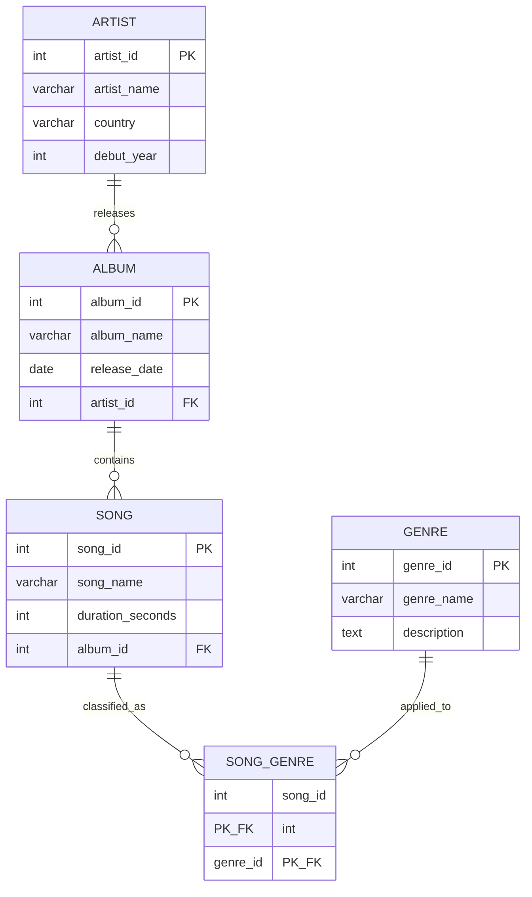

# Music Database Schema Design

## Project Overview

This project is a relational database schema modeling a music catalog system consisting of artists, albums, songs, and genres. The design demonstrates core relational database principles including entity relationship modeling, normalization, referential integrity, and the resolution of many to many relationships through junction tables.

The database is implemented in DuckDB and loaded through the DuckDB CLI using three SQL scripts: one defining the schema structure , one populating it with sample data and one with example analysis queries.

## Design Process

Before writing any SQL, entities, attributes, and relationships were first sketched in draw.io. This step was used to identify the core entities (artist, album, song, genre), assign their attributes, and define the cardinality of each relationship, including the recognition that songs and genres form a many to many relationship requiring a junction table. Once the model was validated visually, it was translated into the DDL in schema.sql and represented formally below using Mermaid.

## Entity Relationship Diagram



## Entities and Attributes

### artist
Stores the core identity of each recording artist.

- artist_id: primary key, unique identifier for the artist
- artist_name: display name of the artist
- country: country of origin
- debut_year: year the artist debuted

### album
Represents a release belonging to a single artist.

- album_id: primary key
- album_name: title of the album
- release_date: full date of release, stored as a date type rather than a year integer to preserve precision
- artist_id: foreign key referencing artist.artist_id

### song
Represents an individual track belonging to a single album.

- song_id: primary key
- song_name: title of the track
- duration_seconds: track length stored in seconds as an integer for straightforward aggregation and comparison
- album_id: foreign key referencing album.album_id

### genre
A lookup table of musical genres, independent of any artist, album, or song.

- genre_id: primary key
- genre_name: name of the genre
- description: free text description of the genre

### song_genre
A junction table resolving the many to many relationship between songs and genres.

- song_id: foreign key referencing song.song_id
- genre_id: foreign key referencing genre.genre_id
- composite primary key on (song_id, genre_id), preventing duplicate genre assignments for the same song

## Relationships

- One artist can release many albums. One album belongs to exactly one artist.
- One album can contain many songs. One song belongs to exactly one album.
- One song can carry many genres, and one genre can apply to many songs. This many to many relationship is resolved through the song_genre junction table.

## Design Principles and Methods

### Normalization

The schema follows Third Normal Form (3NF).

- First Normal Form: every column holds a single atomic value. No repeating groups or comma separated lists exist in any column, including genre assignments, which are handled through a separate junction table rather than a multi valued field.
- Second Normal Form: every non key attribute depends on the whole primary key. Since all base tables use a single column surrogate key, this is satisfied by definition. In song_genre, both columns together form the key and there are no additional non key attributes that could create a partial dependency.
- Third Normal Form: no non key attribute depends on another non key attribute. For example, artist country and debut_year are stored only in artist, not repeated in album or song, eliminating transitive dependency and update anomalies.

### Surrogate Keys

Every entity uses a dedicated integer surrogate key (artist_id, album_id, song_id, genre_id) rather than a natural key such as artist name or album title. This avoids issues that arise from duplicate names, renamed entities, or composite natural keys, and keeps foreign key columns simple and consistent in type.

### Referential Integrity

Foreign key constraints enforce that a row cannot reference a parent that does not exist.

- album.artist_id references artist.artist_id
- song.album_id references album.album_id
- song_genre.song_id references song.song_id
- song_genre.genre_id references genre.genre_id

This guarantees that every album is tied to a real artist, every song is tied to a real album, and every genre assignment is tied to real song and genre records.

### Resolving Many to Many Relationships

Songs and genres form a many to many relationship, which a relational schema cannot represent directly with a single foreign key. The song_genre table resolves this by holding one row per song and genre pairing, with a composite primary key on both columns. This composite key also functions as a natural constraint against duplicate genre tags on the same song.

### One to Many Hierarchy

The artist to album to song structure forms a strict one to many hierarchy at each level. Each child table stores exactly one foreign key pointing to its direct parent, avoiding any need to duplicate parent attributes such as artist_name inside the album or song tables.

### Data Typing Choices

- Dates are stored using the date type (album.release_date) rather than as strings, allowing correct sorting and range filtering.
- Descriptive or variable length fields such as genre.description use text, while bounded fields such as names use varchar(255).
- Numeric identifiers and measures (duration_seconds, debut_year) use int rather than being stored as text, supporting arithmetic and comparison operations without casting.

### Lookup Table Pattern

genre is modeled as an independent lookup table rather than a fixed set of values embedded in the song table. This allows genres to be described, extended, or reused across many songs without altering the song table structure.

## File Structure

- schema.sql: Data Definition Language script that creates all five tables along with their primary key and foreign key constraints.
- seeding.sql: Data Manipulation Language script that inserts sample records for artists, albums, songs, genres, and song genre associations. Written and populated as part of this project.
- analysis.sql: Set of analytical queries written against the schema to explore the seeded data. Written as part of this project to demonstrate practical use of the schema beyond its structure.


## Analysis Queries

The data seeded into the schema was also used to write a set of analytical queries, stored in analysis.sql. These queries go beyond structure and constraints to demonstrate how the schema supports real reporting and exploration once populated.

Run the analysis script after schema.sql and seeding.sql have already been executed:

```sql
-- Song count and total catalog duration per artist
SELECT
    ar.artist_name,
    COUNT(s.song_id) AS total_songs,
    SUM(s.duration_seconds) AS total_duration_seconds,
    ROUND(SUM(s.duration_seconds) / 60.0, 2) AS total_duration_minutes
FROM artist ar
JOIN album al ON ar.artist_id = al.artist_id
JOIN song s ON al.album_id = s.album_id
GROUP BY ar.artist_name
ORDER BY total_songs DESC;


-- Average song duration per album
SELECT
    al.album_name,
    ar.artist_name,
    ROUND(AVG(s.duration_seconds), 1) AS avg_song_duration_seconds
FROM album al
JOIN artist ar ON al.artist_id = ar.artist_id
JOIN song s ON al.album_id = s.album_id
GROUP BY al.album_name, ar.artist_name
ORDER BY avg_song_duration_seconds DESC;


-- Longest song for each artist
SELECT
    artist_name,
    song_name,
    duration_seconds
FROM (
    SELECT
        ar.artist_name,
        s.song_name,
        s.duration_seconds,
        ROW_NUMBER() OVER (
            PARTITION BY ar.artist_id
            ORDER BY s.duration_seconds DESC
        ) AS rank_in_artist
    FROM artist ar
    JOIN album al ON ar.artist_id = al.artist_id
    JOIN song s ON al.album_id = s.album_id
) ranked
WHERE rank_in_artist = 1
ORDER BY duration_seconds DESC;


-- Song count per genre
SELECT
    g.genre_name,
    COUNT(sg.song_id) AS total_songs
FROM genre g
LEFT JOIN song_genre sg ON g.genre_id = sg.genre_id
GROUP BY g.genre_name
ORDER BY total_songs DESC;
```


##  Author

Made by Rui Manalo · [LinkedIn](https://www.linkedin.com/in/rui-manalo-71350a376), [Portfolio](https://www.datascienceportfol.io/ruicourse3)
